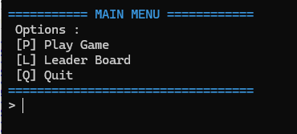
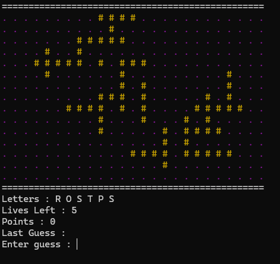
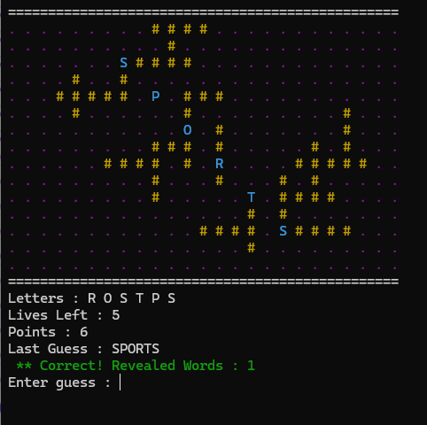
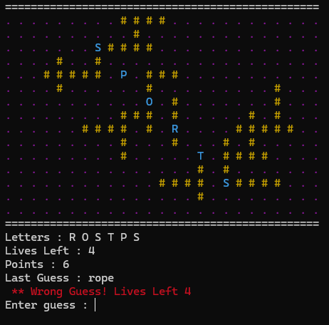
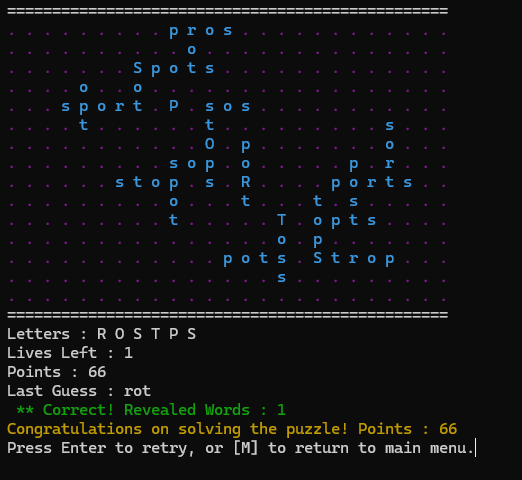
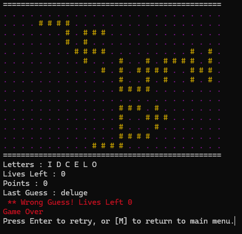
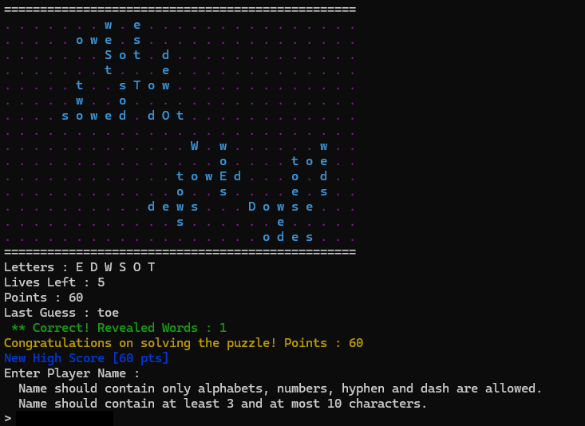
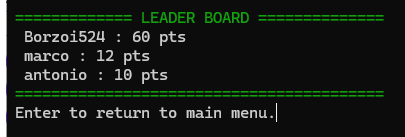
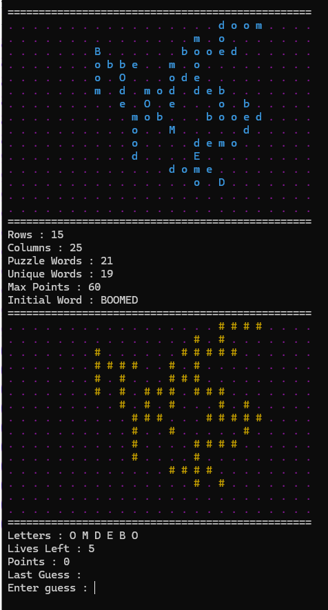

# Introduction
Welcome to Wizards of Worderly Place! In Wizards of Worderly Place, words are laid out magically   
on a playing grid, and you, a wizard, must figure out what the words are, given only six letters!  

# Dependencies
This program requires the following python libraries to run :
- termcolor  
Used to display colors on the terminal.  

- pytest  
Framework used to run the unit tests.  

# User Manual

## Running The Program

### Command
Run the program using the command:  

    python3 worderly.py

### Optional Arguments

Run the program wit the **-h** or **--help** switch to see the optional arguments.  

    python3 worderly.py -h

The output is as follows :  

	usage: worderly.py [-h] [-d] [-f DICT_FILE] [-w WORD_COUNT] [-r ROWS] [-c COLUMNS]  
	
	optional arguments:  
	-h, --help     show this help message and exit  
	-d, --debug    run program in debug mode (answers are displayed)  
	-f DICT_FILE   dictionary file (default is './corncob-lowercase.txt')  
	-w WORD_COUNT  number of words to generate in puzzle (2-51). default is 21  
	-r ROWS        number of rows in puzzle (15-30). default is 15   
	-c COLUMNS     number of columns in puzzle (25-40). default is 25h blah   

## User Interface

### Main Menu
The main menu shown after running the program.  
The player can select any of the options available from the menu list.  

  

#### Options  

- [P] Play Game  
Loads the puzzle and starts the game.  

- [L] Leader Board  
Loads the leader board.  

- [Q] Quit
Exits the program.  

#### How To Exit
Enter [Q], or press [ctrl + c] to close program.

### Puzzle Game

Selecting [P] from the main menu starts the game.  
A puzzle with specified size and word count is shown. 

  

#### Game Mechanics
In this game, the playing area is a 15 x 25 character grid, which will contain a crossword  
puzzle layout composed of several words. The puzzle centers around a 6-letter word, positioned  
diagonally in the 1111 grid in the center, spelled from upper left to the bottom right, with an  
empty cell each letter. 

Only the six-letter word will be positioned diagonally, and with 1-cell gaps between letters.  
This longest word will also be displayed using capital letters.  

Additional words will be composed of letters from the initial 6-letter word and are successively  
added to the grid, intersecting with a letter already placed in the grid. The letters of these words  
will be contiguous in the grid. There can be up to 2 copies of each unique word.  
The additional words are composed of three to five letters, and are spelled out horizontally,  
from left to right, or vertically, from top to bottom.  

When a new game is started, a puzzle grid is generated, with the letters concealed.  
The player will be given the six letters from the longest word, in random shuffled order, and will  
enter word guesses using those letters.

The matching word/s is/are revealed after the valid guess easter. The player gains 1 point for each  
hidden letter that is revealed. 

  

If a player enters an invalid guess, the player will lose one life. 

  

The game ends once all words have been revealed, or if the player loses all their lives.  

#### Puzzle Solved
If all the words on the puzzle are revealed, the game ends and prompts the user to try another game  
or return to the main menu.  

  

#### Game Over
If puzzle remains unsolved and the player loses all lives, the game ends and prompts the user to try another game  
or return to the main menu.  

  

#### High Score
If the current player's score surpasses the leader board's highest score, the player is prompted  
for a player name, and is added to the leader board.  
The puzzle doesn't have to be solved to achieve a high score.  

  

#### How To Exit
Press [ctrl + c] for prompt to return to main menu or exit program.  
Press [ctrl + c] twice to exit program.  

### Leader Board
Selecting [L] from the main menu displays the leader board.  
The leader board shows the top 10 players and their scores.  

  

#### How To Exit
Press [ctrl + c] for prompt to return to main menu or exit program
Press [ctrl + c] twice to exit program

# About The Code

## Program Files

The program is made up of the following files :

- worderly.py  
Contains the entry point of the program.  

- lib_puzzle.py  
Contains class declarations for puzzle management. 

- lib_leaders.py  
Contains class declarations for leader board management. 

- lib_ui.py  
Contains utility methods for the user interface, and displaying output to the console. 

- lib_puzzle_test.py  
Contains unit tests for puzzle management.  

- lib_leaders_test.py  
Contains unit tests for leader board management.  

- corncob-lowercase.txt  
The default lexicon file containing a list of valid English words that the program can use to generate puzzle grids.  

## Classes

This program uses the following main classes :  

### Letter  

A class that defines a letter object on the puzzle.  
Its main attributes are as follows:  

- ***letter***  
A character that represents the letter.
- ***points***  
The point value of the letter.  
A letter worth 1 point.  

- ***row***  
The row position of the letter on the puzzle.  

- ***col***  
The column position of the letter on the puzzle.  

- ***words***  
a list of ***Word*** objects that is associated with this letter
	
### Word  

A class that defines a word/answer object on the puzzle.  
Its main attributes are as follows:  

- ***word***  
A string that represents the word.
- ***letters***  
A list of ***Letter*** objects that is associated with this letter.

### Puzzle  

A class that defines a puzzle object. Its main attributes are as follows:  

- ***matrix***  
A two dimensional array representation of the puzzle.  
Each cell in the array may contain a ***Letter*** object

- ***dict_list***  
A dictionary that contains the words in the lexicon file.  
It is a **key:value** table where : 

	- **key**  
	word length  
	- **value**  
	list of words in the dictionary whose word length is equal to **key**  
	
- ***initial_word***  
A ***Word*** object that represents the default word in the puzzle.  
It is a randome word selected from the words in ***dict_list***  whose word length is 6.

- ***puzzle_words_list***  
List of words that represents a selection of possible puzzle words to pick from.  
It is a list made from the words in ***dict_list***  whose word lengths are 3, 4 and 5.  
This is used when selecting words during puzzle generation.  

- ***answers***  
List of ***Word*** objects that represents all the words on the puzzle.  
These are selected from ***puzzle_words_list*** whose letters are comprised of letters from ***initial_word***.

- ***letters***  
List of ***Letter*** objects that represents all the letters on the puzzle.  

### Player  

A class that defines a player on the leader board.
Its main attributes are as follows:  

- ***name***  
Player name  

- ***points***  
High score (points) of player  

### LeaderBoard  

A class that defines a leader board object.  
Its main attributes are as follows:  

- ***max_size***  
The maximum size of the list to maintain

- ***leaders***  
A list of ***Player*** object that represents players on the leader board.

## Dictionary Management

Words in the lexicon file are loaded into the puzzle's ***dict_list***, which is organized as a **key:value** table where :  

- **key**  
word length  

- **value**  
list of words in the dictionary whose word length is equal to **key**  

## Word Generation

A random selection is applied when generating words for the following :

### Initial Word

A random word is selected from the list of words of the puzzle's ***dict_list*** whose **key** is 6 (word length is 6).  
This is set to the puzzle's ***initial_word***.

### Additional Puzzle Words
Additional are words with length of 3-5 characters from the lexicon that can be formed from the letters of the six-letter word (***initial_word***).  
This is a list from the puzzle's ***dict_list*** whose **key**s are 3, 4, and 5 (word lengths are 3, 4, and 5).  
This list is shuffled to increase randomness.

## Puzzle Generation

A puzzle is generated using the following steps :

1. Create a clone of the all the possible initial words, from the puzzle's dictionary having word length as 6 (***dict_list[6]***).  
This will serve as our **Initial Word List**.  

2. While **Initial Word List**. is not empty :  

	* 2.1. Clear the puzzle.
	
	* 2.2. Select a random initial word from **Initial Word List** and set to puzzle's ***initial_word***.  

	* 2.3. Place ***initial_word*** on the puzzle.
	
		The puzzle's ***initial_word*** is automatically positioned diagonally in the center, spelled from upper-left  
		to the bottom-right,  with an empty cell after each letter.  

		Only the six-letter word will be positioned diagonally,and with a 1-cell gap between letters.  
		This longest word will also be displayed using capital letters.  

		Note : Each letter and initial word are also added into the puzzle's ***letters*** and ***answers*** list respectively.	
	
	* 2.4. Collect all words with length of 3-5 characters from the lexicon that can be formed from the letters of the six-letter word.  
		This is a list from the puzzle's ***dict_list[3]***, ***dict_list[4]***, ***dict_list[5]***.  
		This will serve as our **Additional Puzzle Words List**.  
	
	* 2.5. While **Additional Puzzle Words List** is not empty :  
					
		* 2.5.1. Select a random word from **Additional Puzzle Words List**.  
				
		* 2.5.2. Create a clone of the puzzle's ***letters***. This will serve as our **Letter List**.  
		
			Note : Initially, **Letter List**  contains only the letters from ***initial_word***, but as new letters are added to the puzzle,  
				the size of **Letter List** also grows.  
				
		* 2.5.3. While **Letter List** is not empty :  
					
			* 2.5.3.1. Select a random letter from **Letter List**.  

			* 2.5.3.2. Create a list of orientation ([horizontal, vertical]). This will serve as our **Orientation List**.  
				
			* 2.5.3.3. While **Orientation List** is not empty :  
				
				* 2.5.3.3.1. Pick a random orientation from **Orientation List**.  
				
				* 2.5.3.3.2. Insert random puzzle word from **2.5.1.**, into letter from **2.5.3.1.** with orientation from **2.5.3.3.1.**.  
							Note : See chapter on **Successful Insert Conditions**

				* 2.5.2.3.3 If attempt succeeds, exit **Orientation List** loop.  
							Otherwise, remove orientation from  **Orientation List** (try next orientation).  
							Note : Each successful insert of letter and word are also added into the puzzle's ***letters*** and ***answers*** list respectively.  
							
			* 2.5.3.4. If attempt succeeds, exit **Letter List** loop.   
					Otherwise, remove orientation letter from **Letter List** (try next letter). 
						
		* 2.5.4. If puzzle has required number of words, we have a valid puzzle! Exit **Additional Puzzle Words List** loop.  
				Otherwise, remove word from **Additional Puzzle Words List** (try next word).  
									
	* 2.6. If puzzle has required number of words, we have a valid puzzle! Exit **Initial Word List** loop.  
	   Otherwise, remove word from **Initial Word List** (try next initial word).  

### Successful Insert Conditions  
An insert attempt is possible only under the following conditions :  
- The word to insert (target word) should fit inside the matrix.
- For each cell that the target word's letters will occupy : 
	- If cell is empty
		- If vertical insert
			- Left and right cells should be empty, or out of bounds
			- If first letter, top cell should be empty, or out of bounds
			- If last letter, bottom cell should be empty, or out of bounds
		- If horizontal insert
			- Top and bottom cells should be empty, or out of bounds
			- If first letter, left cell should be empty, or out of bounds
			- If last letter, right cell should be empty, or out of bounds
	- If cell is not empty
		- The cell should be the same as the letter to insert.
		- The cell should be not associated with any word running in the same direction as the target word.  
			(No same direction overlap) 

## Leader Board Management
The leader board data is saved in file ***leaders.csv***.  
It is a CSV file with fields :   

- **name**  
Player Name  

- **points**  
Player's High Score  

The leader board is always sorted (descending) by points, and players falling below the ***max_size*** are removed.

### Loading File
A call to the leader board's ***load()*** method reads the leader board file and creates a leader board.  

### Adding Players
A call to the leader board's ***update()*** method checks if the specified high score is greater than the leader board  
high score, and if so, adds or updates the player's data to the leader board.  
If a previous call to  ***load()*** was made, the current leader board is saved into file.  

### Saving File
A call to the leader board's ***save()*** method saves the current leader board to the leader board file,  
only if ***load()*** was called previously.  

# Unit Tests

Run the unit tests using the command:
Example  :
> pytest

Unit tests are designed for the ***Puzzle*** and ***LeaderBoard*** entities.  

## Puzzle

### Unit Test File
Unit tests for the puzzle are written in the file [lib_puzzle_test.py].  
There are 21 unit tests for this entity.  
The unit tests were basically written to test the validity of a generated puzzle.  

### Unit Test Items
The unit tests fall under the following categories :

#### Irregular Scenarios  

- Invalid Lexicon File  
  The puzzle generator returns an invalid puzzle if invalid dictionary file is specifed.  
  
- Bounds Check for Number of Rows, Columns and Word Count  
  The puzzle generator reverts to default if out of bounds values are specified.  
  The range and default values for each item are as follows :  
 	- Rows : 15-30 (default : 15)  
 	- Columns : 25-40 (default : 25)  
 	- Word Count : 2-51 (default : 21)  
  
- Bare Minimum Test  
  Checks if the puzzle generator is able to generate a valid puzzle only with 1 initial word and  
  10 additional words in the lexicon file . A duplicate of each additional word will appear on the puzzle.  
  
#### Puzzle Validity

- Loading Lexicon File  
  Checks if all words from the lexicon file are loaded into the puzzle's dictionary list.  
  
- Word Count  
  Checks the generated puzzle has specified number of required words.  
  The default is 21 (including the initial word), unless otherwise specified.  

- Puzzle Size 
  Checks if the generated puzzle has specified number of rows and columns.   
  The default number of rows is 15, and columns 25, unless otherwise specified.  
  
- Word Occurrence  
  Checks if each additional word on the generated puzzle appears twice at most.  
 
- Word Validity  
  Checks if each additional word on the generated puzzle is composed of the letters in the initial word.  
  Each letter's occurrence should be at most the number of occurrence in the initial word's letters.  

- Letter Validity  
  Checks if each letter on the generated puzzle is associated to at most 1 diagonal, 1 vertical, 1 horizontal word.  
  
- Word Placement  
  Checks if each additional word on the generated puzzle has no same direction overlap, nor disjoint with adjacent words.  
  This check is done within the ***Puzzle***'s ***is_valid()*** method.  

#### Game Play/State Management
- Guesses
  Validates state of puzzle with correct and incorrect guesses.  
  
- Final State  
  Validates state of puzzle when puzzle is solved, or when lives run out.  

#### Puzzle Generation Success Rate
- Checks if a valid puzzle can be generated if reset several times.  
  Note : This test is set at 100x, but can be adjusted as required.  
  Max test done was at 1000x. Took a while but result was also 100%.  

## Leader Board

### Unit Test File
Unit tests for the puzzle are written in file [lib_leaders_test.py].  
There are 9 unit tests for this entity.
The unit tests were basically written to test the validity of a generated leader board.  

### Unit Test Items
The unit tests fall under the following categories :

#### Irregular Scenarios  

- Bounds Check for Number of Players  
  The leader board generator reverts to default if out of bounds values are specified.  
  The range and default values for each item are as follows :  
 	- Players : 2-50 (default : 10)  

#### Leader Board Validity
- Player Name  
  Tests utility validation checker for player name.  
  This is used during game play when a high score is achieved.  
  A player name is valid if :  
	 - not empty
	 - it contains only alpha numeric characters, hyphen or dash
	 - length is between 3 to 10 characters
    
#### Leader Board Management
- Get Player Info  
  Checks if a player's data can be retrieved by the player's name.  

- Get Leader Board  
  Checks if the list of players (top 10, etc.) can be retrieved from the leader board.  
  
- Get High Score  
  Checks if the highest score can be retrieved from the leader board.  
  
- Update High Score  
  Checks if the high score can be updated on the leader board.  
  
#### File I/O
- Read Leader Board File  
  Checks if the leader board list can be retrieved from a save file.   

- Save Leader Board File  
  Checks if the leader board list can be saved into a save file.  
  
# Bonus Features

1. Main Menu  
Shows a main menu. 

1. Leader Board  
Shows the leader board.  
This feature also allows the user to enter a name when a high score is achieved.  

1. Persistent Leader Board  
Leader board data is saved in a file, so the high scores are still available the next time the game is run.  

1. Game Restart  
The puzzle game can be restared by pressing [ctrl + c] during game play, or when the game ends.  

1. Game Exit  
Pressing [ctrl + c] at any point while the program is running gives the user an option to return to the main menu  
or terminate the program.  

1. Colors  
Colored texts are displayed in the user interface.  

1. Omniscient Mode  
Running the program in debug mode (**-d** or **--debug** switch) reveals the answers during game play.  
This is usefile when evaluating/debugging puzzle generation.  

	  

1. Specify Number of Puzzle Words  
User can specify the number of words in the puzzle using the **-w** option. The default is 21.  

1. Specify Number of Puzzle Rows  
User can specify the number of rows the puzzle has using the **-r** option. The default is 15.  

1. Specify Number of Puzzle Columns  
User can specify the number of columns the puzzle has using the **-c** option. The default is 25.  

1. Show Command Help  
Shows program usage using the  **-h** or **--help** switch.  

# Citation
(TODO : list all references, if any) 
- Online References  
Used the following pages/resources for coding reference.  
	- www.geeksforgeeks.org
	- Stack Overflow
	- CoPilot
	- and a partridge in a pear tree
	- etc
	
# Acknowledgement
(TODO : list contributors, if any) 
- Whiazel Nangpi, Maia Nangpi, Mica Nangpi, Marlon Nangpi  
Helped in user testing, writing manual, feeding me.
